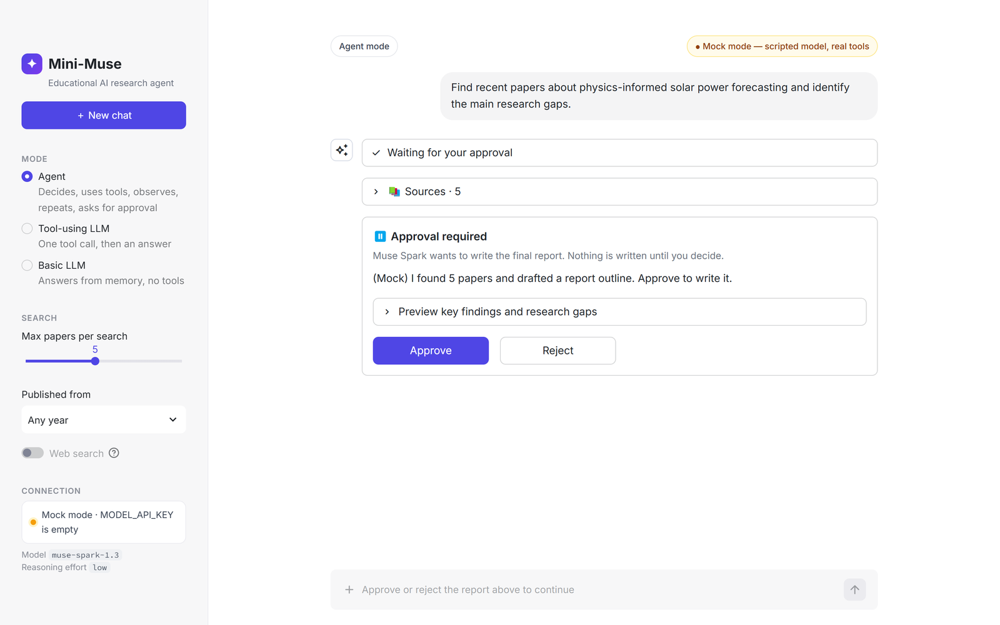
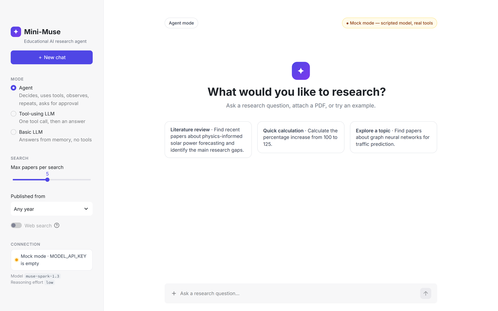
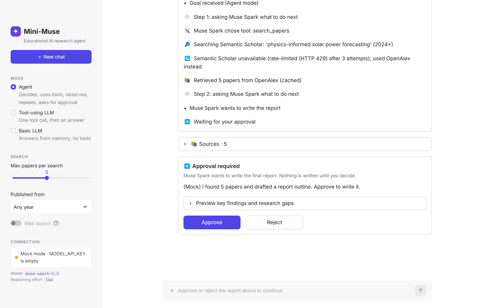
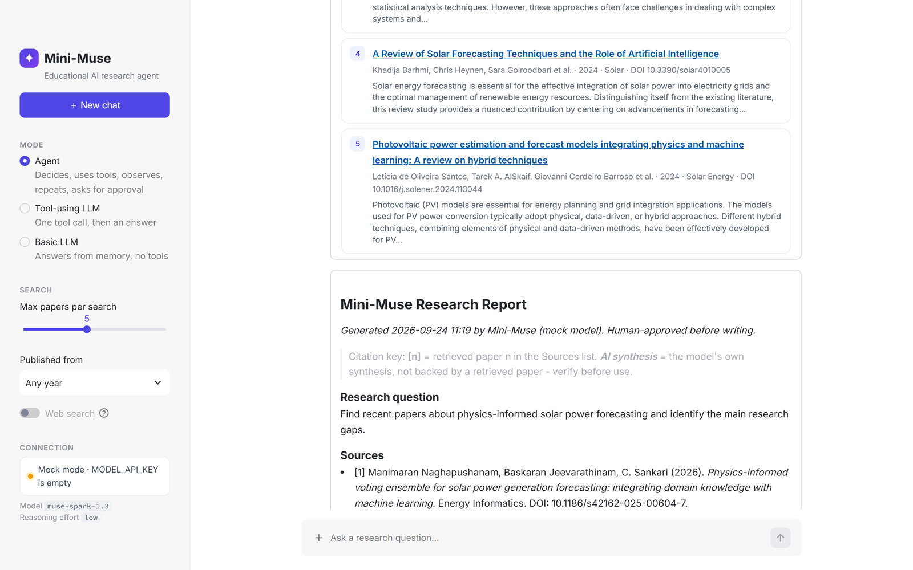

# Mini-Muse — a research agent built on Meta Muse Spark

**Educational AI agent that shows undergraduates how an ordinary LLM app becomes an agent.**

Mini-Muse is a small chat app, in the style of ChatGPT or Claude, that uses Meta's **Muse Spark** model. It can:

- find real research papers,
- read your PDF,
- do safe calculations,
- write a cited research report, **but only after you click Approve.**

The whole project is ~1,600 lines of plain Python (no LangChain, no LangGraph, no vector database), so a student can read it end to end.

```
User Goal → Muse Spark → Decision → Tool Selection → Tool Execution → Observation
          → Next Decision … → Human Approval (enforced by code) → Final Result
```

This project is an educational prototype inspired by Meta Muse and is not an implementation or reproduction of Meta's proprietary Muse product.



📑 **Slides:** [`slides/Mini-Muse-Step-by-Step-Implementation.pptx`](slides/Mini-Muse-Step-by-Step-Implementation.pptx) is a 24-slide, step-by-step lecture on how this project was built, with speaker notes.

---

## Contents

1. [Quick start (5 minutes)](#1-quick-start-5-minutes)
2. [How to use it](#2-how-to-use-it)
3. [Connect the real Muse Spark (API key)](#3-connect-the-real-muse-spark-api-key)
4. [How it works](#4-how-it-works)
5. [Build it yourself, step by step](#5-build-it-yourself-step-by-step)
6. [Tests](#6-tests)
7. [Configuration](#7-configuration)
8. [Project structure](#8-project-structure)
9. [Safety, limitations and future work](#9-safety-limitations-and-future-work)

---

## 1. Quick start (5 minutes)

You need **Python 3.11 or newer** and **Git**. **No API key is needed to try it**: without a key the app runs in *mock mode* (see below).

**Windows (PowerShell):**
```powershell
git clone https://github.com/rajkumar898/muse-spark-research-agent.git
cd muse-spark-research-agent
python -m venv .venv
.venv\Scripts\activate
pip install -r requirements.txt
copy .env.example .env
streamlit run app.py
```

**macOS / Linux:**
```bash
git clone https://github.com/rajkumar898/muse-spark-research-agent.git
cd muse-spark-research-agent
python3 -m venv .venv
source .venv/bin/activate
pip install -r requirements.txt
cp .env.example .env
streamlit run app.py
```

Open **http://localhost:8501** in your browser. Stop the app with **Ctrl+C** in the terminal.

> **Mock mode.** Without an API key, a scripted stand-in replaces Muse Spark, and an orange **Mock mode** badge is shown. The **tools are still real**: paper search calls the real Semantic Scholar / OpenAlex APIs, and the PDF reader and calculator really run. See [section 3](#3-connect-the-real-muse-spark-api-key) to switch to the real model.

---

## 2. How to use it



- **Sidebar:**
  - **＋ New chat** clears the conversation.
  - **Mode**:
    - *Agent*: decides, uses tools, repeats, asks for approval.
    - *Tool-using LLM*: one tool call, then an answer.
    - *Basic LLM*: no tools.
  - **Search settings**: max papers, publication year.
  - **Connection status**: Live or Mock.
- **Chat:** type a question, or click an example card. Attach a PDF with the **+** button in the message box.
- **Each answer shows:**
  - a collapsible **"Worked through N steps"** panel (what the agent did, streamed live),
  - the **Sources** it found,
  - an **Approval required** card (Agent mode),
  - the final report, with a **Download (.md)** button.

### Prompts to try

| Mode | Prompt | What you should see |
|---|---|---|
| Agent | `Calculate the percentage increase from 100 to 125.` | The calculator tool → **25%**. No approval needed. |
| Agent | `Divide 100 by 4` · `What is 15% of 80?` | The calculator tool → **25.0** · **12.0** |
| Agent | `Find recent papers about physics-informed solar power forecasting and identify the main research gaps.` | Paper search → 5 real papers → **Approval required** → Approve → a cited report, saved to `outputs/`. |
| Agent | the same prompt, then **Reject** | *"Stopped: you rejected the report"*. Nothing is written. |
| Basic LLM → Tool-using LLM → Agent | `Calculate the percentage increase from 100 to 125.` | The same question behaves differently in each mode. This is the main teaching point. |
| Tool-using LLM | attach a PDF, then `What dataset and metrics does this paper use?` | *"Reading PDF … selected N chunks"* and the relevant excerpts. |
| Agent | `can you do division task?` | In mock mode: a list of what it can do, with example prompts. |

> **Mock mode understands only these kinds of requests:**
> - calculations (e.g. *calculate …*, *divide X by Y*, *X% of Y*),
> - research requests that mention *papers / research / studies / literature / review*,
> - questions about an attached PDF.
>
> With a real API key, Muse Spark understands any wording.





**Chats are not saved.** They are cleared by *New chat*, a browser refresh, or stopping the app. Only approved reports (`outputs/`) and uploaded PDFs (`uploads/`) are written to disk.

---

## 3. Connect the real Muse Spark (API key)

1. Go to **https://dev.meta.ai**, sign in, open **API keys**, then **Create API key**. Copy it immediately, because it is shown only once. You may need to add a payment method.
2. Open `.env` and paste the key: `MODEL_API_KEY=your_key_here` (no quotes, nothing else on that line).
3. Test the connection with **one** request:
   ```bash
   python meta_client.py
   ```

   | Output | Meaning |
   |---|---|
   | `LIVE OK: …` | Working. Restart the app and the sidebar shows **Live**. |
   | `LIVE FAILED [auth]` | Wrong key. Copy it again. |
   | `LIVE FAILED [billing]` | Add a payment method in the dashboard. |
   | `LIVE FAILED [region]` / `[access]` | Your account or region is not allowed. Keep using mock mode. Do not try to bypass the restriction. |
   | `LIVE FAILED [model_not_found]` | Set `MUSE_MODEL=muse-spark-1.2` in `.env`. |

4. Optional live tests: `RUN_LIVE_TESTS=1 pytest tests/test_live.py` (PowerShell: `$env:RUN_LIVE_TESTS="1"; pytest tests\test_live.py`).

**Cost** (Meta pricing, checked 24 Sep 2026):

| Model | Input | Output | Notes |
|---|---|---|---|
| `muse-spark-1.3` | $1.25 / 1M tokens | $4.25 / 1M tokens | Reasoning tokens count as output. **≈ $0.05 per agent run** (estimate). |
| `muse-spark-1.3-contributor` | $0.10 / 1M tokens | $0.20 / 1M tokens | Much cheaper, but Meta may use your prompts to improve its products, so don't send unpublished work. |

The key lives only in `.env`, which is git-ignored. It is never printed, logged or shown to the model.

---

## 4. How it works

### Relationship to Meta Muse
- **Meta Muse** (https://ai.meta.com/muse/) is Meta's consumer app. It has **no developer API**.
- **Muse Spark** is the model behind it. Developers call it through the **Meta Model API** (`https://api.meta.ai/v1`), which is compatible with the official `openai` Python SDK.
- Mini-Muse calls **Muse Spark** through that API and builds its *own* small agent around it. It never uses OpenAI's servers or models.

### Architecture
```
                ┌───────────────────── app.py (Streamlit chat UI) ────────────────────┐
                │ sidebar: new chat · mode · search settings · attached PDF · status  │
                │ chat: message (+PDF) → live steps → sources → approve → report      │
                └───────────────┬─────────────────────────────────▲───────────────────┘
                                │ start / approve / reject        │ state dict (st.session_state)
                                ▼                                 │
                ┌────────────── agent.py (state machine + loop) ─────────────────────┐
                │ IDLE → RUNNING → WAITING_APPROVAL → APPROVED → REPORTING → DONE    │
                │                                   → REJECTED → DONE     | ERROR    │
                └──────┬──────────────────────────┬────────────────────────┬─────────┘
                       │ respond(history, tools)  │ validate + execute     │ after approval only
                       ▼                          ▼                        ▼
      ┌──── meta_client.py ────┐   ┌───────── tools.py ─────────┐   report_generator.py
      │ MetaClient (live)      │   │ registry + JSON Schemas    │    → outputs/*.md
      │ MockMetaClient         │   │ argument validator         │
      │ ResilientClient        │   ├── paper_search.py (Semantic Scholar → OpenAlex)
      └──────────┬─────────────┘   ├── pdf_reader.py   (pypdf, chunks, keyword ranking)
                 ▼                 └── calculator.py   (AST whitelist, no eval)
   openai SDK → https://api.meta.ai/v1/responses   (model muse-spark-1.3)
```

### The agent loop (`agent.py`)
```python
while status == RUNNING:
    if steps >= MAX_STEPS (8): stop with a clear message
    result = muse_spark(history, tool_schemas)          # DECIDE
    if no tool calls: final answer → DONE
    for each call:
        if generate_report: validate, then PAUSE (WAITING_APPROVAL)
        else: validate → execute → append observation   # ACT + OBSERVE
```

### Human approval, enforced by code
1. When the model calls `generate_report`, `agent.py` validates the arguments but **does not run it**. It saves the call and switches to `WAITING_APPROVAL`.
2. The chat shows an **Approval required** card, and the message box is locked.
3. **Approve** writes the report without any extra model call. **Reject** sends "rejected" back and stops cleanly.
4. The model is called only when you send a message, so Streamlit reruns can never repeat an API call.

### The four tools (the only things the model can run)
| Tool | What it does |
|---|---|
| `search_papers(query, year_from?, max_results 1–10)` | Semantic Scholar first. On HTTP 429 it waits (honours `Retry-After`), then falls back to OpenAlex. Returns **only real results**: title, authors, year, venue, abstract, DOI, URL. Cached for 1 hour. |
| `read_pdf(question)` | pypdf text → ~2,000-word chunks with a 200-word overlap → the 6 chunks with the most keyword overlap. Rejects non-PDF, encrypted, scanned and >20 MB files. |
| `calculate(expression)` | AST whitelist: numbers, `+ - * / ** %`, parentheses, `sqrt abs round mean rmse pct_change`. No `eval`. At most 200 characters. |
| `generate_report(...)` | **Runs only after you click Approve.** Ten sections. Every claim cites papers `[n]` or is labelled *AI synthesis*. The Sources list is written by code from real search results. |

---

## 5. Build it yourself, step by step

This is the order in which the project was built. Each step matches a file and a group of slides in the deck.

| Step | What you build | File(s) | Slides |
|---|---|---|---|
| 0 | Settings in `.env`, with an automatic switch to mock mode | `config.py`, `.env.example` | 6–7 |
| 1 | Call Muse Spark with the OpenAI SDK (`base_url=https://api.meta.ai/v1`), normalise replies, handle errors (401/404/429/timeout/region), add a mock client that returns the same response shape | `meta_client.py` | 8–9 |
| 2 | Describe each tool with a JSON Schema; validate every call in Python before it runs | `tools.py` | 10–11 |
| 3 | The real tools: paper search with fallback, PDF chunking, safe calculator | `paper_search.py`, `pdf_reader.py`, `calculator.py` | 12–13 |
| 4 | The agent loop: decide → act → observe, with an 8-round limit | `agent.py`, `prompts.py` | 14–15 |
| 5 | Human approval as a state machine; a report with verified citations | `agent.py`, `report_generator.py` | 16–17 |
| 6 | A Streamlit chat UI with live steps, sources, approval card and three modes | `app.py`, `.streamlit/config.toml` | 18–20 |
| 7 | Offline tests with the mock client | `tests/` | 21 |

Detailed API facts (endpoint, request format, tool-calling format, what was verified and when) are in [`IMPLEMENTATION_NOTES.md`](IMPLEMENTATION_NOTES.md).

**Exercises** (slide 23): add a reasoning-effort selector · add a new tool · remember earlier questions · save chats · use embeddings for PDFs · compare live vs mock tool choices.

---

## 6. Tests

```bash
pytest -q        # 123 passed, 2 skipped: no network, no Meta API calls
```

| File | Covers |
|---|---|
| `test_calculator.py` | Operators, functions, `pct_change(100,125) == 25`, rejects `__import__('os')`, names, attributes, huge exponents |
| `test_search.py` | Semantic Scholar parsing, missing fields, 429 → retry → OpenAlex fallback, `Retry-After`, timeout, no results |
| `test_tools.py` | Unknown tool, wrong mode, bad JSON, wrong types, extra arguments, range checks, deep report validation |
| `test_pdf.py` | Extraction from a generated PDF, chunk overlap, relevance, file-name sanitising, non-PDF, >20 MB, encrypted, image-only |
| `test_agent.py` | Reaches `WAITING_APPROVAL`, reruns don't re-call the model, approve writes the report, reject stops, `MAX_STEPS`, one-round limit in tool mode, API error → `ERROR` |
| `test_meta_client.py` | Response parsing, request format, 401/403/404/402/400/region errors, 429 retry, timeout, key never in messages, mock fallback, what the mock understands |
| `test_live.py` | Real API text and tool call (skipped unless `RUN_LIVE_TESTS=1`) |

---

## 7. Configuration

All settings live in `.env` (copy it from `.env.example`).

| Variable | Default | Meaning |
|---|---|---|
| `MODEL_API_KEY` | *(empty)* | Meta Model API key. Empty → mock mode. |
| `MUSE_MODEL` | `muse-spark-1.3` | Also `muse-spark-1.2`, `muse-spark-1.1`, `muse-spark-1.3-contributor`. |
| `MUSE_BASE_URL` | `https://api.meta.ai/v1` | API base URL. |
| `MUSE_REASONING_EFFORT` | `low` | `minimal` · `low` · `medium` · `high` · `xhigh` · `max`. Reasoning tokens are billed as output. |
| `MINI_MUSE_MOCK` | `0` | `1` = always use the mock model. |
| `SEMANTIC_SCHOLAR_API_KEY` | *(empty)* | Optional: higher Semantic Scholar rate limits. |
| `OPENALEX_API_KEY` | *(empty)* | Optional: avoids OpenAlex anonymous rate limits. |
| `RUN_LIVE_TESTS` | *(unset)* | `1` = also run the tests that call the real API. |

---

## 8. Project structure

```
muse-spark-research-agent/
├── app.py                  # Streamlit chat UI
├── agent.py                # agent loop + state machine + human approval
├── meta_client.py          # Meta Model API wrapper + MockMetaClient
├── tools.py                # tool registry, JSON Schemas, validation
├── paper_search.py         # Semantic Scholar → OpenAlex search
├── pdf_reader.py           # PDF validation, extraction, chunking
├── calculator.py           # safe AST calculator
├── report_generator.py     # cited Markdown report
├── prompts.py              # instructions for each mode
├── config.py               # settings from .env
├── requirements.txt
├── .env.example
├── .streamlit/config.toml  # theme, 20 MB upload limit
├── tests/                  # 123 offline tests + 2 live tests
├── slides/                 # step-by-step lecture deck (.pptx)
├── docs/images/            # screenshots used in this README
├── uploads/                # uploaded PDFs (git-ignored)
├── outputs/                # approved reports (git-ignored)
├── README.md
└── IMPLEMENTATION_NOTES.md
```

---

## 9. Safety, limitations and future work

**Safety**
- The model can only run the four registered tools, and only with validated arguments. It can never run shell commands or Python, read arbitrary files, or see environment variables or keys.
- Uploaded files are saved only in `uploads/`, with sanitised names (`../../x.pdf` → `x.pdf`). Reports are written only to `outputs/`.

**Limitations**
- **Not yet run with a live key.** All end-to-end runs so far used mock mode. The request format follows Meta's official docs and is covered by HTTP-level tests.
- The free Semantic Scholar / OpenAlex APIs rate-limit anonymous users, so a search can take ~45 s. Free API keys fix this.
- PDF relevance uses keyword overlap, not embeddings. Scanned PDFs are not supported.
- The mock "model" is a script: its report text is a placeholder, and it understands only a few phrasings.
- No chat history across sessions. Each question is independent.

**Future work**
- Run live and tune the prompts on real Muse Spark behaviour.
- Remember earlier questions; save chat history.
- Embeddings for PDFs; OCR for scanned PDFs.
- A "trace view" showing each raw request and response, for teaching.

---

## License

This project is released under the [MIT License](LICENSE). Copyright © 2026 Raj Kumar ([@rajkumar898](https://github.com/rajkumar898)).

You are free to use, copy, modify and share the code, slides and screenshots, including for teaching, as long as you keep the copyright notice and the license text. The software is provided "as is", without warranty.

"Meta", "Muse" and "Muse Spark" are trademarks of Meta Platforms, Inc. This project is not affiliated with or endorsed by Meta.
